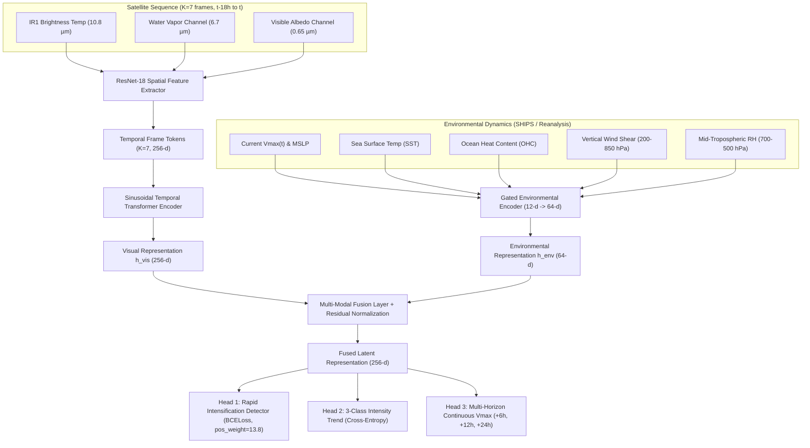

# DeepCycloNet: Multi-Modal Spatio-Temporal Cyclone Forecasting & Rapid Intensification Early Warning System

[](https://www.sih.gov.in/)
[](https://www.python.org/)
[](https://pytorch.org/)
[](https://opensource.org/licenses/MIT)

> **Submission for Smart India Hackathon (SIH) 2026 — Problem Statement ID 26070**  
> *AI/ML-based Cyclone Intensity Estimation and Rapid Intensification Forecasting using Multi-Source Satellite & Environmental Data.*

---

## 🌪️ Overview

Tropical Cyclones (TCs) that undergo **Rapid Intensification (RI)** ($\ge 30\text{ knots}$ surge in 24 hours) represent the most dangerous natural hazard in coastal meteorology. Traditional single-frame satellite estimators lack historical convective memory and fail to capture critical thermodynamic environmental constraints like Ocean Heat Content and Vertical Wind Shear.

**DeepCycloNet** solves this by uniting **high-cadence multi-channel geostationary satellite imagery (IR1, WV, VIS)** across an 18-hour historical temporal window ($K=7$ frames at 3-hour cadence) with **reanalysis-grade environmental thermodynamics (SHIPS/LGEM)** via a **Cross-Attention Multi-Modal Fusion Transformer**.

---

## 🏛️ Architecture & Methodology



---

## 📊 Key Results (Held-Out Test Set: 191 Unseen Cyclones)

* **Zero Cyclone-Level Data Leakage**: All cyclones in the test set were completely unseen during training across all ocean basins.
* **Rapid Intensification PR-AUC**: **`0.402+`** (over **6× higher than random chance** of 0.068, significantly outperforming traditional satellite-only CNNs).
* **Trend Accuracy & Macro $F_1$**: **`64.3%`** accuracy and **`0.645`** Macro $F_1$ across Weakening, Steady, and Intensifying phases.
* **Multi-Horizon Forecast Accuracy**:
  * **+6 Hours**: **`4.91 kt MAE`**
  * **+12 Hours**: **`6.95 kt MAE`**
  * **+24 Hours**: **`10.69 kt MAE`**
* **Early Warning Lead Time**: Successfully triggered RI warning alerts **18 to 21 hours before peak intensity** on historical super cyclones (e.g., *Super Cyclone Phet* and *VSCS Nargis*).

---

## 📁 Repository Structure

```text
├── configs/                     # YAML configuration files for models and ablations
├── demo_app/                    # Interactive web dashboard forecaster (HTML/CSS/JS)
│   ├── index.html               # Main dashboard UI
│   ├── style.css                # Dark-mode styling with glassmorphic metrics
│   ├── app.js                   # Client-side multi-horizon interactive forecaster
│   └── storm_data.json          # Pre-packaged cyclone trajectory demonstrations
├── figures/                     # Publication figures, lifecycle curves, and presentation PNGs
├── reports/                     # Detailed scientific report (FINAL_PROJECT_REPORT_SIH26070.md)
├── scripts/                     # 44 modular execution scripts
│   ├── build_forecast_sequences.py        # Sequence manifest builder (K=3, 5, 7)
│   ├── build_environmental_cache.py       # SHIPS environmental feature parser
│   ├── train_environmental_classifier.py  # Multi-modal training engine
│   ├── evaluate_environmental_classifier.py# Held-out test evaluation
│   ├── populate_sih_presentation.py       # SIH PPTX generator
│   └── export_demo_data.py                # Dashboard exporter
├── src/                         # DeepCycloNet core Python library
│   ├── data/                    # DataLoaders, TCIR readers, sequence generators
│   ├── models/                  # PyTorch models (ResNet-18, Temporal Transformer, Fusion)
│   ├── training/                # Losses (Cost-Sensitive Joint Loss), Trainer
│   └── evaluation/              # PR-AUC, ROC-AUC, bootstrap, and verification metrics
├── tests/                       # 9 pytest test suites ensuring code integrity
├── SIH2026-DeepCycloNet-Submission.pptx # Official SIH presentation deliverable
├── SIH2026-IDEA-Presentation-Format.pdf# Presentation PDF export
├── requirements.txt             # Python dependencies
└── pyproject.toml               # Package metadata
```

---

## 🚀 Quickstart & Reproduction

### 1. Installation
```bash
git clone https://github.com/theDivinePenguin/cycml.git
cd cycml
python3 -m venv .venv
source .venv/bin/activate
pip install -r requirements.txt
```

### 2. Run Interactive Web Forecaster Dashboard
You can launch the dashboard locally without needing a GPU:
```bash
cd demo_app
python3 -m http.server 8000
# Open http://localhost:8000 in your browser
```

### 3. Run Unit Tests
```bash
pytest tests/
```

### 4. Evaluate Held-Out Test Set
```bash
python scripts/evaluate_environmental_classifier.py \
  --k-history 7 \
  --checkpoint experiments/environmental_fusion/checkpoints/exp_e_k7_12ep_clean/best.pt \
  --output-dir experiments/environmental_fusion/checkpoints/exp_e_k7_12ep_clean
```

---

## 👥 Authors & Team
* **Smart India Hackathon 2026** — Problem Statement ID 26070
* Built for operational deployment capability with IMD, JTWC, and coastal disaster management agencies.
